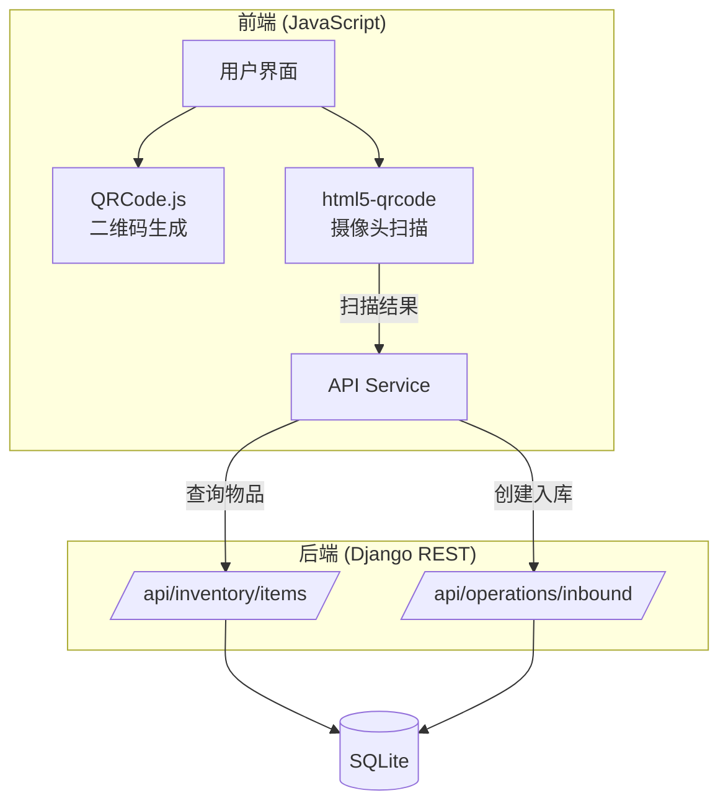

# Design Document: Barcode Scanning Inbound

## Overview

扫码入库功能为库存管理系统提供基于二维码的快速入库能力。该功能包含两个核心模块：

1. **二维码生成模块** - 为每个物品生成基于 Item_Code 的二维码，支持显示、打印和下载
2. **摄像头扫描模块** - 使用网页摄像头实时扫描二维码，识别物品并触发快速入库流程

系统采用纯前端方案实现二维码生成和扫描，通过现有的 REST API 完成物品查询和入库操作。

## Architecture



### 技术选型

| 组件 | 技术方案 | 说明 |
|------|----------|------|
| 二维码生成 | qrcode.js | 轻量级纯 JS 库，无依赖 |
| 摄像头扫描 | html5-qrcode | 支持多种条码格式，兼容性好 |
| 打印功能 | window.print() | 浏览器原生打印 API |
| 下载功能 | Canvas toDataURL | 将二维码导出为 PNG |

## Components and Interfaces

### 1. QRCodeManager - 二维码管理器

负责二维码的生成、显示和导出。

```javascript
const QRCodeManager = {
    /**
     * 生成二维码并显示在指定元素中
     * @param {string} elementId - 容器元素ID
     * @param {string} code - 物品编码
     * @param {object} options - 配置选项
     */
    generate(elementId, code, options = {}) {},
    
    /**
     * 下载二维码为PNG图片
     * @param {string} code - 物品编码
     * @param {string} filename - 文件名
     */
    download(code, filename) {},
    
    /**
     * 打印物品标签
     * @param {object} item - 物品信息
     */
    printLabel(item) {}
};
```

### 2. CameraScannerManager - 摄像头扫描管理器

负责摄像头权限管理、扫描和结果处理。

```javascript
const CameraScannerManager = {
    scanner: null,  // html5-qrcode 实例
    isScanning: false,
    
    /**
     * 打开摄像头扫描模态框
     */
    open() {},
    
    /**
     * 关闭扫描并释放摄像头
     */
    close() {},
    
    /**
     * 处理扫描成功
     * @param {string} decodedText - 解码后的文本
     */
    onScanSuccess(decodedText) {},
    
    /**
     * 处理扫描错误
     * @param {string} error - 错误信息
     */
    onScanError(error) {}
};
```

### 3. QuickInboundManager - 快速入库管理器

负责快速入库弹窗的显示和入库操作。

```javascript
const QuickInboundManager = {
    currentItem: null,
    
    /**
     * 显示快速入库弹窗
     * @param {object} item - 物品信息
     */
    show(item) {},
    
    /**
     * 关闭弹窗
     */
    close() {},
    
    /**
     * 执行入库操作
     * @param {number} quantity - 入库数量
     */
    async submitInbound(quantity) {}
};
```

### 4. API 接口

使用现有的 API 接口：

| 接口 | 方法 | 用途 |
|------|------|------|
| `/api/inventory/items/?code={code}` | GET | 根据编码查询物品 |
| `/api/inventory/items/{id}/` | GET | 获取物品详情 |
| `/api/operations/inbound/` | POST | 创建入库记录 |

## Data Models

### 前端数据结构

```typescript
// 物品信息（从API获取）
interface Item {
    id: number;
    name: string;
    code: string;           // Item_Code: ITEM-YYYYMMDD-XXXX
    barcode: string;
    category_name: string;
    warehouse_name: string;
    stock: number;
    price: number;
    image: string | null;
}

// 入库请求
interface InboundRequest {
    item: number;           // 物品ID
    quantity: number;       // 入库数量
    supplier?: number;      // 供应商ID（可选）
    notes?: string;         // 备注（可选）
}

// 扫描结果
interface ScanResult {
    success: boolean;
    code: string;           // 扫描到的编码
    item?: Item;            // 匹配到的物品
    error?: string;         // 错误信息
}
```

### 后端数据模型

使用现有的 `Item` 和 `InventoryOperation` 模型，无需修改。


## Correctness Properties

*A property is a characteristic or behavior that should hold true across all valid executions of a system-essentially, a formal statement about what the system should do. Properties serve as the bridge between human-readable specifications and machine-verifiable correctness guarantees.*

Based on the acceptance criteria analysis, the following correctness properties have been identified:

### Property 1: QR Code Round-Trip Consistency

*For any* valid Item_Code string (format: ITEM-YYYYMMDD-XXXX), encoding it as a QR code and then decoding the QR code SHALL produce the exact same Item_Code string.

**Validates: Requirements 1.4, 1.5**

### Property 2: Quick Inbound Modal Displays All Required Fields

*For any* item object with valid data, when displayed in the Quick_Inbound_Modal, the rendered content SHALL contain the item's name, code, and current stock value.

**Validates: Requirements 4.1**

### Property 3: Inbound Operation Updates Stock Correctly

*For any* valid item and positive quantity, after a successful inbound operation, the item's stock SHALL equal the previous stock plus the inbound quantity.

**Validates: Requirements 4.2, 4.3**

### Property 4: Invalid Quantity Validation

*For any* quantity value that is less than or equal to zero, the inbound form validation SHALL reject the submission and display an error.

**Validates: Requirements 4.4**

## Error Handling

### Camera Permission Errors

| 错误场景 | 处理方式 |
|----------|----------|
| 用户拒绝摄像头权限 | 显示提示信息，说明如何在浏览器设置中启用权限 |
| 设备无摄像头 | 显示错误提示，建议使用有摄像头的设备 |
| 摄像头被占用 | 显示错误提示，建议关闭其他使用摄像头的应用 |

### Scan Errors

| 错误场景 | 处理方式 |
|----------|----------|
| 扫描到无效二维码 | 忽略，继续扫描 |
| 扫描到的编码不存在 | 显示"物品未找到"提示，继续扫描 |
| API 请求失败 | 显示网络错误提示，允许重试 |

### Inbound Errors

| 错误场景 | 处理方式 |
|----------|----------|
| 数量为空或无效 | 显示验证错误，阻止提交 |
| 入库 API 失败 | 显示错误信息，保留表单数据允许重试 |

## Testing Strategy

### Unit Tests

使用 Jest 进行单元测试：

1. **QRCodeManager 测试**
   - 测试二维码生成函数正确调用 QRCode 库
   - 测试下载功能生成正确的 data URL

2. **QuickInboundManager 测试**
   - 测试表单验证逻辑
   - 测试入库请求数据格式

3. **CameraScannerManager 测试**
   - 测试扫描结果处理逻辑
   - 测试错误处理逻辑

### Property-Based Tests

使用 fast-check 进行属性测试：

1. **QR Code Round-Trip Property**
   - 生成随机有效的 Item_Code
   - 编码为 QR 码数据
   - 解码并验证与原始值相等

2. **Quantity Validation Property**
   - 生成随机数量值（包括负数、零、正数）
   - 验证只有正数通过验证

3. **Stock Update Property**
   - 生成随机初始库存和入库数量
   - 验证入库后库存 = 初始库存 + 入库数量

### Integration Tests

1. **扫描到入库完整流程**
   - 模拟扫描成功
   - 验证物品查询
   - 验证入库弹窗显示
   - 验证入库操作成功

## UI Design

### 1. 仪表盘扫码入库按钮

```
┌─────────────────────────────────────────┐
│ [📊 导出报告] [🔍 扫码入库] [➕ 添加物品] │
└─────────────────────────────────────────┘
```

### 2. 摄像头扫描模态框

```
┌─────────────────────────────────────────┐
│ 🔍 扫码入库                        [✕] │
├─────────────────────────────────────────┤
│                                         │
│   ┌─────────────────────────────┐      │
│   │                             │      │
│   │      📷 摄像头预览区域       │      │
│   │                             │      │
│   │   ┌───────────────────┐    │      │
│   │   │   扫描框          │    │      │
│   │   └───────────────────┘    │      │
│   │                             │      │
│   └─────────────────────────────┘      │
│                                         │
│   将二维码对准扫描框                    │
│                                         │
└─────────────────────────────────────────┘
```

### 3. 快速入库弹窗

```
┌─────────────────────────────────────────┐
│ 📦 快速入库                        [✕] │
├─────────────────────────────────────────┤
│                                         │
│   ┌──────┐  物品名称: 笔记本电脑包      │
│   │ 图片 │  编码: ITEM-20241206-A1B2    │
│   └──────┘  当前库存: 5 件              │
│                                         │
│   入库数量: [________] 件               │
│                                         │
│   备注: [________________________]      │
│                                         │
│        [取消]  [确认入库]               │
│                                         │
└─────────────────────────────────────────┘
```

### 4. 物品详情二维码区域

```
┌─────────────────────────────────────────┐
│ 物品二维码                              │
├─────────────────────────────────────────┤
│                                         │
│         ┌─────────────┐                │
│         │  █ █ █ █ █  │                │
│         │ █ █ █ █ █ █ │                │
│         │  █ █ █ █ █  │                │
│         │ █ █ █ █ █ █ │                │
│         └─────────────┘                │
│                                         │
│      ITEM-20241206-A1B2                │
│                                         │
│   [🖨️ 打印标签]  [⬇️ 下载二维码]        │
│                                         │
└─────────────────────────────────────────┘
```

## Dependencies

### CDN Libraries

```html
<!-- QRCode.js - 二维码生成 -->
<script src="https://cdn.jsdelivr.net/npm/qrcodejs@1.0.0/qrcode.min.js"></script>

<!-- html5-qrcode - 摄像头扫描 -->
<script src="https://cdn.jsdelivr.net/npm/html5-qrcode@2.3.8/html5-qrcode.min.js"></script>
```

### Browser Requirements

- 支持 `navigator.mediaDevices.getUserMedia` API
- 支持 Canvas API
- 支持 ES6+ JavaScript
